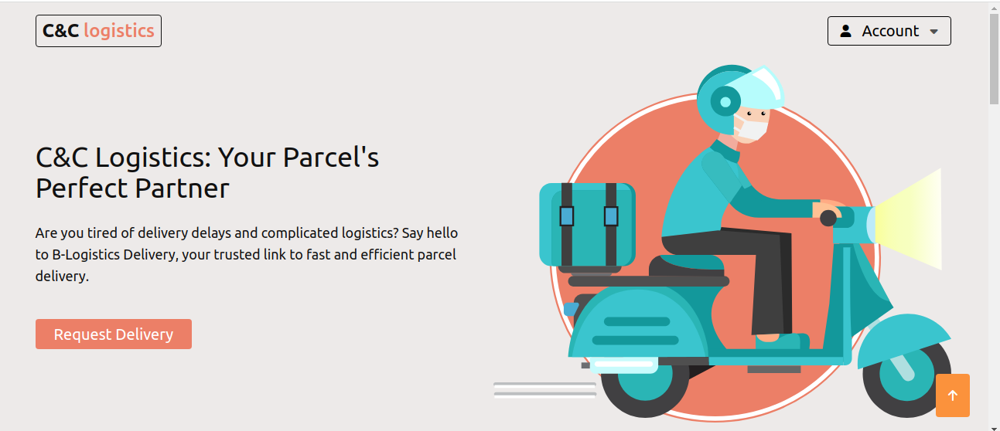

# C&C logistics



## Project Overview

The aim of building this logistics app is to provide a convenient, efficient, and reliable solution for transportation and delivery needs. Our primary goal is to leverage technology to streamline the logistics process, connect users in need of delivery services with registered riders or drivers, and facilitate the seamless movement of goods from one location to another.

### Built With

- Flask
- Python
- HTML
- CSS
- JavaScript
- jQuery
- SQLite

## Getting Started

To get started with this project, follow the steps below:

### Prerequisites

- You will need a Google Maps API key.
- Set your email password credentials as `MAIL_PASSWORD` in the `.env` file.
- set your Google Maps API key as `API_key`

### Installation

1. Clone the repository.
   ```sh
   git clone https://github.com/chidiadi-emmanuel-nwosu/C-C_Logistics.git
   ```
2. Install the required packages.
	```sh
	pip install -r requirements.txt
	```
3. Configure your .env file with your Google Maps API key and email password credentials.
	```sh
	MAIL_PASSWORD=YOUR_MAIL_PASSWORD
	API_KEY=YOUR_API_KEY
	```
### Start the application.
   ```sh
   python3 -m app.run_app
   ```

### Contributing
We welcome contributions from the community. If you have suggestions to make this project better, please create a pull request or open an issue with the "enhancement" tag. Don't forget to star the project if you find it useful!

License
This project is licensed under the MIT License - see the LICENSE file for details.

## Authors
- Chidiadi Nwosu [Github](https://github.com/chidiadi-emmanuel-nwosu/) / [Linkedin](https://chidiadi-nwosu) / [Email](chidiadi.emmanuel.nwosu@gmail.com) 
- Chinenye Nmoh [Github](https://github.com/ChinenyeNmoh/) / [Linkedin](https://www.linkedin.com/in/chinenye-nmoh-88479699/) / [Email](chinenyeumeaku@gmail.com) 
